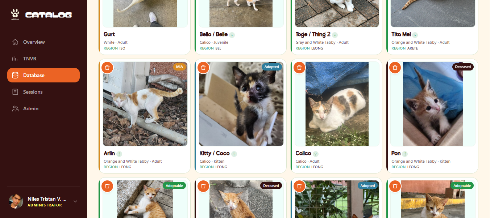

# AGILA CATalog



A campus cat census and management app for **AGILA** (_Ateneans Guided and Inspired by their
Love for Animals_), the Ateneo de Manila University student organization behind the cat
Census (CATalog) project and the TNVR (Trap–Neuter–Vaccinate–Return) program.

It has two sides. **Inside**, AGILA members run census sessions, manage the cat database, log
health interventions, and review each other's data. **Outside**, anyone can browse a public
catalog of adoptable cats — no login, and indexed by search engines.

The app is a deliberately **non-disruptive layer** over AGILA's existing Google Sheets. The
database is the source of truth, but the regional sheets stay in **two-way sync**, so the org
keeps a familiar, always-current fallback if the app is ever unavailable. Almost every
non-obvious rule in this codebase exists to keep that arrangement honest.

| | |
| --- | --- |
| **Use the app** | [ateneanagila.com](https://ateneanagila.com/) |
| **Learn to use it** (non-technical) | [User Manual](https://docs.google.com/document/d/1SWO1l1zoXQlZ03wWfUd4xTdMDSRbLVJb7KdZwZ3iqaA/edit) · source in [`docs/handbook/`](docs/handbook/AGILA-User-Manual.md) |
| **Work on the code** | **[docs/development.md](docs/development.md)** — start here |
| **Run or repair the sync** | [docs/operations/gsheets-sync-setup.md](docs/operations/gsheets-sync-setup.md) |
| **Everything else** | [docs/](docs/README.md) |

---

## Why it exists

AGILA tracks hundreds of cats across campus — health status, neutering history, vaccination
records, adoption eligibility. That lived in a scatter of Google Workspace tools: a shared
CATalog spreadsheet, Forms, a Facebook page. Data entry was error-prone, onboarding was
labour-intensive, and adoptable cats were hard for the public to find.

This app fixes that without throwing the old system away. Volunteers do their work in the
app, which validates input and keeps records consistent; managers review and approve what
they submit. The sheets stay synced both ways so external stakeholders keep their familiar
view — and so AGILA can fall back to the spreadsheet at any time. Volunteers get **view-only**
sheet access; managers and admins keep edit access as an emergency route.

---

## What it does

### Census sessions

A **session** is one trip out to count cats in one region, with a `census_no` and a roster.
A volunteer creates it, adds cats through the entry form, and submits. Managers then review
in two steps — **Info Validation** (fix the details) then **Cross-Reference** (approve as new,
or merge duplicates).

Cat lifecycle: `Unsubmitted → Unreviewed → Original`, or `Merged` with `merged_into_id` set.
A finished session is immutable.

### Cat database

Identity, status, location, health record, photo, and merge tracking. Managers have full CRUD
across **General**, **Medical**, and **Interventions**; volunteers see those screens read-only
but have full create/edit inside session forms — that's their workflow.

Photos are **crop-as-metadata**: the stored blob is always the full original, and zoom, offset,
and rotation are applied at render time. Re-framing costs no upload and never touches the
sheet.

### Interventions

Per-cat **TNVR** or **Veterinarian** actions, moving `Pending → Finished` or `Cancelled`.

### Public catalog

A no-login directory of cats marked adoptable, with search and a **shareable page per cat**.
Catalog pages are server-rendered with canonical URLs and a generated `sitemap.xml`, so
search engines can index them.

Health information is reported **honestly rather than optimistically**: vaccination reads
**Yes / Expired / Unknown** (expired = vaccinated over a year ago), and sick/injured read
**Unknown** when nothing has been recorded rather than defaulting to a clean bill of health.

### Dashboards

**Overview** — population stats, regional breakdowns, and locations ranked by days since
their last census. **TNVR** — neutering-coverage score with a sex/neuter breakdown, filterable
by location.

### Admin

Administrator-only, six sections in this order:

| Section | What it does |
| --- | --- |
| **Users & Access** | invite and remove people, change roles |
| **GSheet Config** | sync status + **Unfreeze**, **Provision Sheets**, **Seed UUIDs**, **Retire sync** |
| **Photo Storage** | usage gauge + **Reclaim orphaned photos** |
| **Bug Reports** | reports submitted from inside the app; resolve and reopen |
| **Links** | edit the Adopt / Foster Form and Referral Sheet targets without a deploy |
| **Regions** | add, rename, delete campus locations (and their sheet tabs) |

**Freeze and Retire are different things.** Freeze is an automatic, reversible safety pause
after a failed tick. **Retire** is the deliberate, permanent end of the sync — it stops all
writes and releases the app's column protections, so AGILA is left with a spreadsheet it can
still edit rather than one locked by an app that no longer runs.

### Access control

Sign-in is an **allowlist** (`allowed_emails`), not a domain rule — an admin must add an
address before Google OAuth will let it through.

| Role | Capabilities |
| --- | --- |
| Volunteer | Run census sessions (full create/edit inside session forms); view-only elsewhere |
| Manager | + review/approve sessions, full cat-database CRUD, Census Report |
| Administrator | + the Admin tab |

Enforced server-side via `requireRole(...)`. Client-side gating is never sufficient on its own.

---

## How it works

The database is authoritative; a sync engine mirrors it to the regional sheets and pulls human
edits back.

```
Volunteers / Managers / Admins → AGILA CATalog Web App
                                      ↕
                              PostgreSQL (Supabase)   ← source of truth
                                      ↕ two-way sync
                            Google Sheets (CATalog, per region)
```

A Cloudflare Worker (`workers/sync-cron/`) fires every 20 minutes, health-checks `/api/health`,
then POSTs `/api/cron/sync` with a shared `CRON_SECRET`. Each tick reads every region sheet
once, then runs:

```
Phase 0    one paced read of every region sheet
Phase 0.5  reconcile representation   — repair rows missing or on the wrong tab
           idle early-exit            — nothing pending? stop here
Phase 1    reverse sync   sheet → DB
Phase 2    photo import   sheet → blob
Phase 3    forward sync   DB → sheet
Phase 4    summary regen  For RI / For FA
```

Three things about that order are deliberate:

- **Reconciliation runs before the idle exit.** Forward sync is task-driven, so nothing would
  otherwise notice a cat whose row went missing. It costs no extra API calls, since Phase 0
  has already read everything.
- **Reverse runs before photo import**, so a cat created from a new sheet row exists before
  the importer tries to attach its photo.
- **Conflict resolution is last-edit-wins** with a 5-second DB-favouring buffer.

Column `Y` holds a UUID that **is** the cat's database primary key — that single fact is what
binds the two systems together, and a row without one is invisible to sync.

Failures auto-freeze the sync and post a Discord alert. Every run is recorded in
`sync_audit_log`.

> **Before changing any of this, read
> [docs/architecture/sync-engine.md](docs/architecture/sync-engine.md).** It documents the
> column contract and several invariants that look like dead code and are not.

### Google Apps Script

An installable trigger on the spreadsheet handles sheet-side bookkeeping: timestamping edits
in column W, recording the editor in column X, minting the column-Y UUID on first entry, and
flagging hand-made region tabs that sync cannot see. Structural setup is done server-side from
the Admin tab as the service account, not from Apps Script.

---

## Tech stack

| Layer | Technology |
| --- | --- |
| Framework | Next.js 16 (App Router, React 19) |
| Language | TypeScript (strict) |
| Styling | Tailwind CSS 4 |
| UI | Mostly custom; Radix `Slot` + CVA for `Button` |
| Data | Server Components for initial load, server actions thereafter |
| Actions | `next-safe-action` 8 |
| Validation | Zod 4 (+ `drizzle-zod`) |
| ORM / DB | Drizzle ORM + Drizzle Kit · PostgreSQL via Supabase |
| Auth | Supabase Auth + Google OAuth (SSR), admin allowlist |
| Storage | Supabase Storage |
| Google APIs | Sheets, Drive |
| Images | Sharp (server), Canvas (client normalize) |
| Cron | Cloudflare Workers |
| Alerts | Discord webhooks |
| Charts | Recharts |
| Tests | Jest (node env, sync-focused) |

> No client data-fetching library is in use. These dependencies are declared but **unimported**
> and pending removal: `@tanstack/react-query`, `better-auth`, `browser-image-compression`,
> `node-html-parser`, `drizzle-seed`, `@testing-library/*`.

---

## Getting started

```bash
pnpm install          # pnpm only — never npm
cp .env.example .env  # then fill it in
pnpm dev
```

[`.env.example`](.env.example) lists the ten variables the app actually reads, annotated.
Values come from the Vercel project settings — ask an admin.

**Prerequisites:** Node 20+, pnpm, a Supabase project, a Google Cloud project with the Sheets
and Drive APIs enabled, and a service account with access to the CATalog spreadsheet.

> ⚠️ **There is no staging environment.** Local development points at production — one
> database, one spreadsheet, one bucket. `pnpm dev` never runs a sync tick itself, but local
> edits queue tasks that *production* cron drains within 20 minutes. Read
> [docs/development.md §2](docs/development.md) before running anything.

Schema changes are pushed, not migrated:

```bash
pnpm drizzle-kit push   # reads DIRECT_DATABASE_URL, not DATABASE_URL
```

---

## Testing

```bash
pnpm jest __tests__   # 35 suites / 348 tests, ~3s
pnpm tsc --noEmit     # type-check
```

Coverage concentrates on the sync system — the riskiest, least-visible part of the app. UI is
not tested: `testEnvironment` is `node` and there are no component tests.

Every external seam is mocked, so the suite runs offline — **and cannot catch a bad SQL
fragment.** Verify database-shaped changes against real data with a throwaway script. See
[docs/development.md §5](docs/development.md) for the mocking pattern.

---

## Layout

```
app/          routes · server actions (app/actions/) · API routes
components/   ui/ primitives · app-pages/ feature screens
lib/
  repo/       all direct DB queries live here
  services/   business logic, transactions, sync
  validation/ Zod schemas (mostly drizzle-zod derived)
  db/         Drizzle schema, enums, relations
workers/      sync-cron/ Cloudflare Worker · apps-script/ sheet-side .gs
docs/         see docs/README.md
__tests__/    Jest suites
scripts/      one-off data and maintenance scripts
```

The layering is strict: `app/actions/*` (auth + validation) → `lib/services/*` (business rules)
→ `lib/repo/*` (**every** `db.*` call). Services must not query the database directly.

### Core tables

| Table | Purpose |
| --- | --- |
| `cats` | Cat records (identity, status, region override, photo, `paws_id`) |
| `cat_health_records` | One-to-one health record (condition, neuter, vaccination) |
| `regions` | Campus locations — free-text `name`, managed in-app |
| `sessions` · `session_users` · `session_cats` | Census sessions, their volunteers, their cats |
| `interventions` | Per-cat interventions (type, status, notes) |
| `profiles` · `allowed_emails` | User profiles and the registration allowlist |
| `gsheet_sync_queue` | Pending forward-sync operations with retry state |
| `sync_audit_log` | History of sync runs |
| `system_config` | Key-value config (e.g. `sync_frozen`) |

---

## Documentation

| Doc | For |
| --- | --- |
| [docs/development.md](docs/development.md) | **new developers** — setup, layering, a full walkthrough, testing |
| [docs/architecture/sync-engine.md](docs/architecture/sync-engine.md) | the column contract, cron phases, invariants |
| [docs/architecture/data-model.md](docs/architecture/data-model.md) | schema, lifecycles, effective region |
| [docs/architecture/frontend.md](docs/architecture/frontend.md) | the mobile/desktop two-screen strategy |
| [docs/operations/gsheets-sync-setup.md](docs/operations/gsheets-sync-setup.md) | provisioning, cutover, production recovery |
| [docs/operations/handoff.md](docs/operations/handoff.md) | who owns what, how the hosts are wired, what keeps it alive |
| [docs/operations/decommissioning.md](docs/operations/decommissioning.md) | retiring the sync deliberately |
| [docs/handbook/](docs/handbook/AGILA-User-Manual.md) | the non-technical user manual |
| [CLAUDE.md](CLAUDE.md) | the same conventions in imperative form, for AI agents |

---

## Contributing

See [CONTRIBUTING.md](CONTRIBUTING.md) for the Git workflow (feature → dev → prod).
